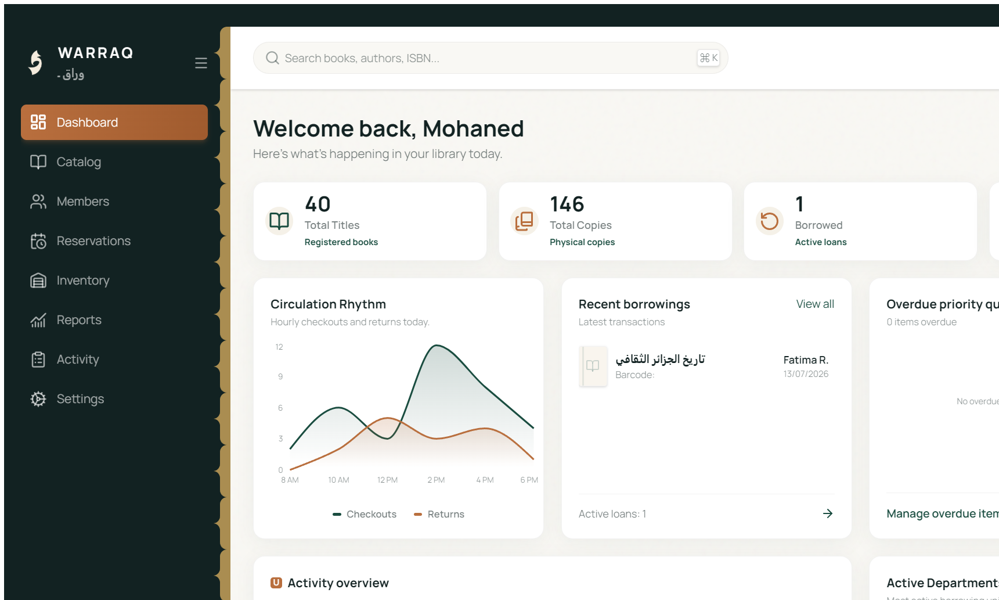
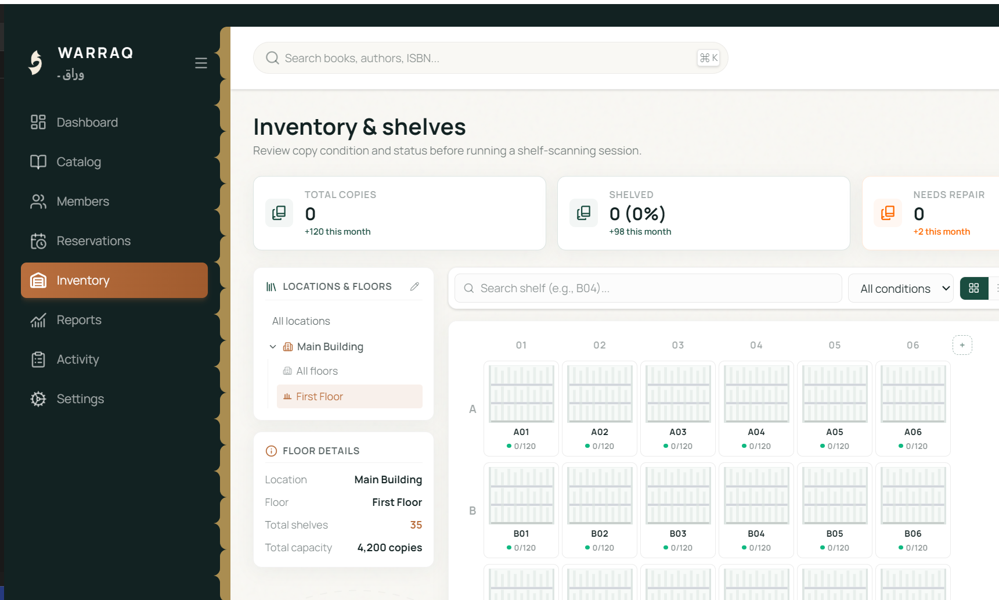

<h1 style="font-family: Arial, sans-serif; font-size: 36px; color: #0F766E; display: flex; align-items: center; gap: 12px; border-bottom: 3px solid #0F766E; padding-bottom: 8px;">
  Warraq — Library Management System
</h1>

Warraq is a local-first desktop system for the Mustapha Bacha Hospital library. It supports catalogue work, circulation, inventory, member records, reporting, and configurable metadata integrations while keeping library data in a local SQLite database.

---

## Tech Used


---

## Features

- Dashboard, catalogue, circulation activity, inventory, members, reservations, and reports
- Local SQLite storage with Rust-managed migrations and seeded data
- Arabic, English, and French interface translations
- Barcode support and image upload controls
- Import/export workflows for CSV and Excel data
- Offline-first operation with optional Open Library, Google Books, Library of Congress, Crossref, ISBNdb, Groq, and custom HTTPS metadata providers
- Custom titlebar, persistent window state, single-instance behavior, shortcuts, and close-to-tray workflow
- Stronghold-backed API-key storage and scoped Tauri capabilities

---

## Screenshots



**Dashboard:** A local library overview with titles, copies, active loans, circulation rhythm, and recent borrowing activity.

---



**Inventory:** Shelf, floor, and copy-condition controls for physical collection operations.

---

## Project Structure

```text
src/
|-- app/                    # Application shell and providers
|-- components/             # Layout and shared UI components
|-- data/                   # SQLite setup, seed data, repositories
|-- i18n/                   # Arabic, English, and French translations
|-- sections/               # Dashboard, catalogue, inventory, members, reports, settings
|-- store/                  # UI state
|-- utils/                  # ISBN, dates, currency, and metadata helpers
`-- main.tsx                # React entry point

src-tauri/
|-- migrations/             # Local database migrations
|-- capabilities/           # Tauri permission definitions
|-- src/                    # Native tray and application logic
|-- tauri.conf.json         # Build and desktop configuration
`-- Cargo.toml              # Rust dependencies
```

---

## Getting Started

### Prerequisites

- Node.js 18+
- pnpm
- Rust toolchain
- Tauri system dependencies for your operating system

### Install and run

```bash
pnpm install
pnpm tauri dev
```

For frontend-only work, run `pnpm dev`. Note that the full application requires the Tauri runtime to open its local database.

---

## Available Scripts

```bash
pnpm dev          # Start Vite
pnpm build        # Type-check and build frontend assets
pnpm typecheck    # Run TypeScript checking
pnpm test         # Run Vitest tests
pnpm rust:check   # Check the Rust/Tauri application
pnpm tauri dev    # Run the desktop app
```

---

## Data and Security

- Application data is stored in `sqlite:warraq.db` in the Tauri app-data directory.
- Preferences use Tauri Store; sensitive provider credentials belong in Tauri Stronghold.
- Backup and export data must not include Stronghold secrets.
- Provider URLs are validated by native code and require HTTPS except localhost during development.

---

## Everyday Workflows

- **Cataloguing:** Search or add records, enrich them with metadata providers, and maintain copy information.
- **Circulation:** Track active loans, member activity, reservations, and returns from the local desktop workspace.
- **Inventory:** Review shelves by location and floor, then record copy condition and availability.
- **Reporting:** Use the reporting and export views to share library activity without exporting secure credential data.

---

## Keyboard and Tray Behavior

- `Ctrl/Cmd + K` opens the command palette.
- `/` focuses the main search workflow.
- `Ctrl/Cmd + ,` opens settings.
- The system tray can restore the app, open search or circulation, open settings, and quit explicitly.
- When configured, closing the window hides it to the tray instead of terminating the application.
